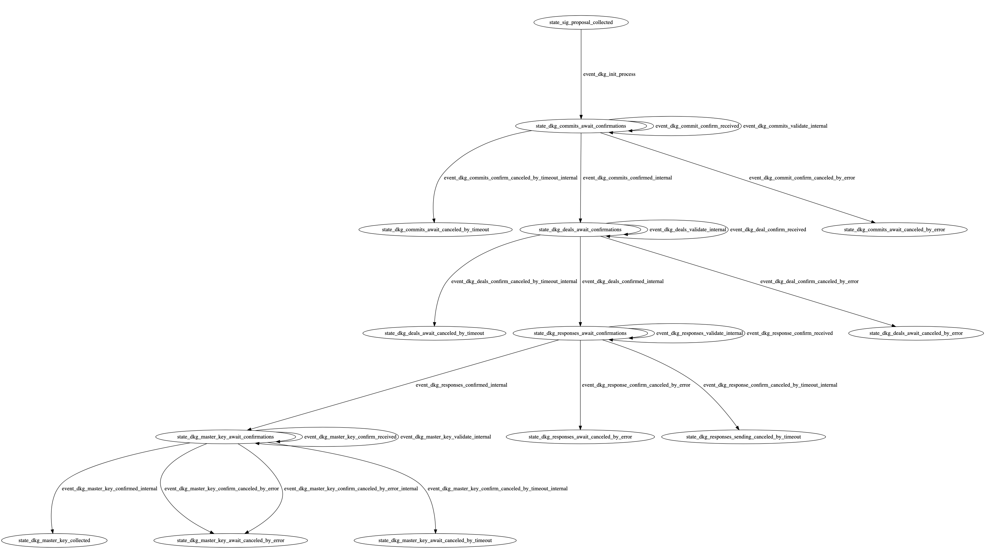
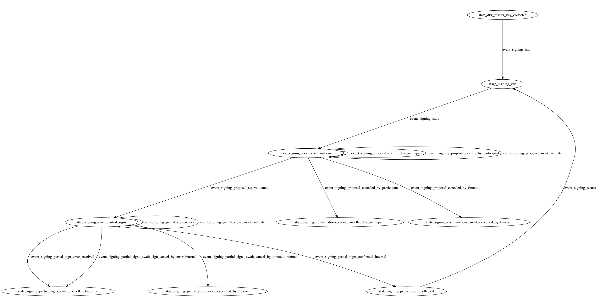

# Finite-state machines description

We moved away from the idea of one large state machine that would perform all tasks, so we divided the functionality into three separate state machines:
* SignatureProposalFSM - responsible for collecting agreements to participate in a specific DKG round
* DKGProposalFSM - responsible for collecting a neccessary data (pubkeys, commits, deals, responses and reconstructed pubkeys) for a DKG process
* SigningProposalFSM - responsible for signature process (collecting agreements to sign a message, collecting partial signs and reconstructed full signature)

We implemented a FSMPoolProvider containing all three state machines that we can switch between each other by hand calling necessary events.

For example, when SignatureProposalFSM collected all agreements from every participant it's state becomes *state_sig_proposal_collected*.
That means it's time to start a new DKG round to create shared public key. We can do it by sending *event_dkg_init_process* event to the FSM.

## Visual representation of FSMs
### SignatureProposalFSM

### DKGProposalFSM

### SigningProposalFSM

